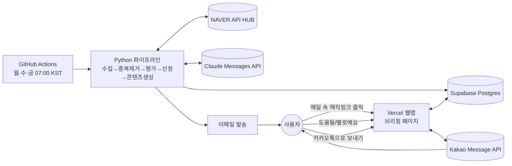

# Phase 3 — 기술 설계

Phase 1·2에서 승인된 제품 설계를 실제로 구현하기 위한 아키텍처, 데이터, 운영
설계입니다. 이 단계에서는 코드를 작성하지 않았습니다 (Phase 4에서 구현).

지금까지 확정된 전제를 기준으로 설계했습니다 — **월·수·금 07:00 KST 실행**,
**이메일 자동 발송 + 매직링크 웹앱 + 카카오톡(도움됨 기사만, 메시지 1건)** 3단
채널, **피드백이 다음 회차 점수 계산에 자동 반영**, **휴대폰·다른 컴퓨터에서도
접속 가능**(완전 공개 배포는 아님).

## 01. 시스템 아키텍처

배치(정기 실행)와 상시 서비스(웹앱)를 분리했습니다. GitHub Actions는 월·수·금
아침에만 깨어나 수집·평가·이메일 발송을 끝내고, Vercel의 작은 웹앱은 항상
켜져 있으면서 매직링크 접속·피드백 저장·카카오 발송 요청만 처리합니다.
두 쪽 다 같은 Supabase DB를 공유합니다.



- **GitHub Actions (배치)**: 정기 실행 3회/주. 상태 없음 — 실행마다 새로 시작하고
  결과는 전부 DB에 저장. 무료 티어로 충분.
- **Vercel (상시 웹앱)**: 매직링크 페이지 서빙 + 피드백 저장 API + 카카오 발송
  트리거 API. Python 서버리스 함수로 구현. Hobby(무료) 플랜으로 충분.

## 02. 데이터 흐름 (파이프라인 13단계)

Phase 1에서 정의한 순서를 그대로 따르되, 10~13단계가 이메일/웹앱/카카오
3채널 구조에 맞게 구체화되었습니다.

```
1.  실행 트리거 (GitHub Actions cron)
2.  NAVER API HUB로 키워드군별 뉴스 수집 (최근 24시간)
3.  기사 정규화 (제목/언론사/발행시각/링크/URL 해시)
4.  7일 이내 재발송 이력 대조 → 이미 보낸 기사 제외
5.  중복·유사 기사 제거 (동일 이슈 → 최고 신뢰도 1건만)
6.  광고성/보도자료 1차 필터 (규칙 기반)
7.  전략 키워드 1차 스코어링 → 상위 후보만 다음 단계로
8.  Claude로 후보 기사 정성 평가 (6기준 100점 + 가산점)
9.  최종 7~10건 선정 (점수 + 중복 규칙 + 카테고리 다양성)
10. 선정 기사 요약·전략 해석·실무 적용 아이디어 생성 (Claude)
11. 결과를 Supabase에 저장 (수집·검토·선정 전 단계 모두)
12. 매직링크 발급 → 이메일 발송 (실패해도 11번 저장은 유지)
13. 사용자가 웹앱에서 피드백 → 태그 가중치 갱신 → 다음 실행 시 반영
    (카카오 발송은 웹앱에서 사용자가 트리거할 때만 별도로 일어남)
```

## 03. DB 스키마 (Supabase Postgres)

단일 사용자 기준이라 `user_id` 없이 설계했습니다. 실제 구현은
[`sql/schema.sql`](../sql/schema.sql) 참고.

```
runs                    -- 실행 1회 = 1행
  id            uuid PK
  run_date      date
  status        text        -- running / done / failed
  collected_n   int
  reviewed_n    int
  selected_n    int
  error_message text null
  started_at    timestamptz
  finished_at   timestamptz

articles                -- 수집된 기사 (전 단계 공통)
  id            uuid PK
  run_id        uuid FK -> runs
  title         text
  source        text
  published_at  timestamptz
  url           text
  url_hash      text        -- 정규화 URL 해시, 재발송 방지용 unique index
  tier          text        -- collected / reviewed / selected
  created_at    timestamptz

evaluations              -- articles : evaluations = 1:1 (reviewed 이상만)
  article_id      uuid PK FK -> articles
  base_score      int
  bonus_score     int
  final_score     int
  tags            text[]      -- 최대 3개, 태그 목록에서 선택
  is_duplicate    boolean
  duplicate_of    uuid null FK -> articles
  is_ad           boolean
  summary         text        -- 핵심 내용
  interpretation  text        -- 전략 해석
  application     text        -- 실무 적용 아이디어
  reject_reason   text null   -- 탈락 시에만

feedback                 -- 사용자가 누른 도움됨/별로예요
  id            uuid PK
  article_id    uuid FK -> articles
  rating        text        -- good / bad
  rated_at      timestamptz

tag_weights               -- 학습 루프: 태그별 누적 반영치
  tag                text PK
  good_count         int
  total_count         int
  weight_adjustment  numeric   -- 다음 회차 가산점 보정에 곱해지는 값
  updated_at         timestamptz

kakao_sends
  id            uuid PK
  sent_at       timestamptz
  article_ids   uuid[]
  status        text        -- success / failed
  error_message text null

kakao_tokens               -- 단일 행, 암호화된 값만 저장
  id            int PK default 1
  access_token  text  -- 애플리케이션 레벨 암호화
  refresh_token text  -- 애플리케이션 레벨 암호화
  expires_at    timestamptz
```

## 04. 모듈 구조

```
news-briefing/
├─ pipeline/
│  ├─ run_pipeline.py      # GitHub Actions 엔트리포인트, 13단계 오케스트레이션
│  ├─ collector.py         # NAVER API HUB 호출·정규화
│  ├─ dedup.py             # 유사도 기반 중복 판별
│  ├─ filters.py           # 광고성/보도자료 1차 필터
│  ├─ scorer.py            # Claude 평가 호출 + 점수 계산
│  ├─ selector.py          # 최종 7~10건 선정
│  ├─ briefing.py          # 이메일/카카오 콘텐츠 생성
│  ├─ weights.py           # 피드백 → 태그 가중치 자동 조정
│  └─ emailer.py           # 매직링크 발급 + 이메일 발송
├─ web/                    # Vercel 배포 대상
│  ├─ api/
│  │  └─ index.py          # GET /api/briefing, POST /api/feedback, POST /api/kakao-send
│  └─ public/index.html    # 승인된 목업 기반 페이지
├─ shared/
│  ├─ db.py                # Supabase 클라이언트
│  ├─ kakao_client.py      # 토큰 갱신 포함 Kakao API 래퍼
│  └─ magic_link.py        # 토큰 서명/검증
├─ tests/                  # pytest, Phase 2의 20건 데이터를 fixture로 재사용
└─ .github/workflows/briefing.yml
```

(실제 구현은 3개 API를 `web/api/index.py` 하나의 FastAPI 앱으로 합쳤습니다 —
Vercel 서버리스 함수 개수를 아끼기 위한 조정입니다. 원래 계획은
`briefing.py`/`feedback.py`/`kakao_send.py`로 분리하는 것이었습니다.)

## 05. API 연동 방법

- **NAVER API HUB**: 키워드군(최우선 전략 / STP / 4P / 추가 수집 분야)별로
  개별 호출 후 병합, `sort=date`, `display`/`start`로 페이지네이션. 헤더에
  Client ID/Secret.
- **Claude Messages API**: 후보 기사를 구조화된 JSON으로 평가 요청(점수·태그·
  요약·해석을 한 번에). 공통 채점 기준은 프롬프트 캐싱으로 비용 절감.
- **Kakao Message API**: 최초 1회 수동 OAuth 인증 후 Access/Refresh Token 발급.
  발송은 Feed 템플릿 사용 — 제목이 자동으로 굵게 렌더링되고 설명 필드 길이
  제한이 텍스트 템플릿보다 넉넉해 승인된 메시지 형태를 그대로 구현 가능.
- **이메일 발송**: 개인 Gmail 계정 기준 SMTP + 앱 비밀번호 방식 — 별도 이메일
  서비스 가입 없이 바로 시작 가능, 일 500통 한도로 이 용도엔 충분. 추후
  발송량이 늘면 Resend 등 API 서비스로 교체 가능하도록 모듈 분리.

## 06. 인증정보 관리

| 정보 | 저장 위치 | 비고 |
|---|---|---|
| NAVER / Claude API 키 | GitHub Actions Secrets, 로컬 `.env` | 코드·로그 노출 금지 |
| Kakao Access/Refresh Token | Supabase `kakao_tokens` 테이블 | 애플리케이션 레벨 암호화(Fernet 등) 후 저장, 만료 시 자동 갱신 |
| Gmail 앱 비밀번호 | GitHub Actions Secrets | 일반 로그인 비밀번호 아님, 앱 전용 비밀번호 별도 발급 |
| 매직링크 서명 시크릿 | Vercel 환경변수 + GitHub Actions Secrets(동일 값) | 양쪽에서 같은 키로 서명/검증 |
| Supabase service role key | GitHub Actions / Vercel 서버사이드 환경변수 | 클라이언트(브라우저)에 절대 노출 금지 |

## 07. 오류 처리 & 재시도 정책

- **NAVER / Claude 호출 실패**: 지수 백오프 3회 재시도 (2s → 4s → 8s). 3회 모두
  실패하면 해당 단계 건너뛰고 `runs.status = failed`, 사유 기록. 이미 확보된
  이전 단계 데이터는 DB에 남김.
- **이메일 발송 실패**: 3회 재시도 후 최종 실패 시 `runs`에 기록만 하고
  파이프라인은 정상 종료 취급 — 분석 결과 저장은 발송 성패와 무관.
- **카카오 발송 실패**: 토큰 만료면 자동 갱신 후 1회 재시도, 그 외 오류는
  3회 재시도 후 `kakao_sends.status = failed` 기록. 사용자에게는 웹앱에
  "발송 실패, 다시 시도" 표시.
- **DRY_RUN 모드**: 환경변수 하나로 이메일·카카오 실제 발송만 건너뛰고
  나머지(수집~DB 저장)는 그대로 실행 — 안전하게 반복 테스트 가능.

## 08. 로깅 및 모니터링

별도 모니터링 서비스 없이 가진 도구만으로 충분한 규모입니다. GitHub Actions
실행 로그(기본 90일 보관) + Supabase `runs` 테이블의 요약 지표(수집/검토/선정
건수, 실행시간, 실패 여부)를 함께 봅니다. 파이프라인이 실패하면 같은 이메일
채널로 "브리핑 실패" 알림을 보내 별도 채널을 새로 만들지 않습니다.

## 09. 배포 및 정기 실행

```yaml
# .github/workflows/briefing.yml (요약)
on:
  schedule:
    - cron: '0 22 * * 0,2,4'   # UTC 기준 → 월·수·금 07:00 KST
  workflow_dispatch: {}         # 수동 실행 버튼 (테스트용)
```

웹앱(`web/`)은 GitHub main 브랜치에 push될 때마다 Vercel이 자동으로
재배포합니다. 별도 배포 스크립트가 필요 없습니다.

> **2026-09-14 갱신**: 실제로는 아직 이 저장소가 Vercel 프로젝트로 import된
> 적이 없습니다 — `.env`의 `WEB_BASE_URL`이 가리키는 도메인은 무관한 다른
> Next.js 앱이 응답합니다. `docs/SETUP.md` 8단계를 실행해야 합니다.

## 10. 테스트 계획

- **단위테스트(pytest)**: dedup, 필터, 점수 계산, 가중치 조정 함수 각각 독립 검증
- **통합테스트**: Phase 2에서 만든 가상 기사 20건을 fixture로 재사용해
  "선정 7건이 나오는지" 회귀 테스트
- **외부 API는 전부 mock 처리** — 네트워크 없이 CI에서 테스트 가능
- **DRY_RUN 실행**: 실제 API 키로 1회 돌려보되 발송은 생략, 결과만 확인
- **수동 확인**: 실제 이메일 1통, 실제 카카오 메시지 1통을 본인에게 발송해
  최종 확인 (Phase 4 마지막 단계)

## 11. 예상 비용

| 서비스 | 용도 | 예상 비용 |
|---|---|---|
| GitHub Actions | 정기 실행 | 무료 (Private 레포 무료 분수 내) |
| Vercel | 웹앱 호스팅 | 무료 (Hobby 플랜) |
| Supabase | DB | 무료 (이 규모엔 충분) |
| Kakao Message API | 나에게 보내기 | 무료 |
| Gmail SMTP | 이메일 발송 | 무료 |
| NAVER API HUB | 뉴스 수집 | 콘솔에서 확인 필요 |
| Claude API | 평가·요약·해석 | 주 3회 기준 월 소액 추정 (모델 확정 후 재계산) |

## 최종 확정 설정값

1. **이메일 발송 방식** — 확정: Gmail SMTP (앱 비밀번호)
2. **매직링크 유효기간** — 확정: 14일 (발급 후 14일 경과 시 만료, 다음 메일의
   새 링크로만 접근)
3. **가중치 자동 조정 안전장치** — 확정: 초기값대로 시작 (한 태그에 최소 5건
   이상 피드백이 쌓여야 반영, 1회 최대 ±5점 조정), 실제 사용하며 값을 조절
4. **호스팅 계정** — 확정: 기존 Vercel·Supabase 계정 사용, 별도 가입 없이
   프로젝트만 새로 연결
